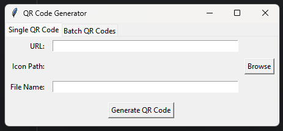
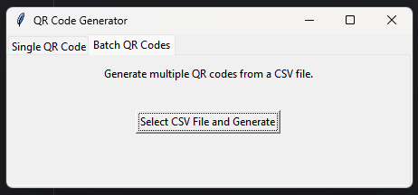

# QR Code Generator

This Python project enables users to generate QR codes with optional icons in three flexible modes:

1. **Web Application**: Browser-based QR code generator powered by Flask.
2. **Desktop Application**: Interactive GUI built with Tkinter for single and batch QR code creation.
3. **Command-Line Interface (CLI)**: Perfect for advanced users and automation.

## Features

- **Single QR Code Generation**:
  - Generate QR codes for individual URLs with optional embedded icons.
- **Bulk QR Code Generation**:
  - Process CSV files to create multiple QR codes at once, each with optional icons.
- **High-Resolution Output**:
  - Generate QR codes up to 3000x3000 pixels.
- **Cross-Platform Support**:
  - Available as a desktop app, CLI tool, or web application.

## Example Output


## Requirements

### General Requirements
- **Python**: Version 3.7 or higher.
- **Libraries**:
  - [**Flask**](https://flask.palletsprojects.com): Web framework for the web app.
  - [**Pillow**](https://pillow.readthedocs.io): Image processing.
  - [**Segno**](https://pypi.org/project/segno): QR code generation.
  - [**Werkzeug**](https://werkzeug.palletsprojects.com): Utilities for Flask applications.
  - [**Tkinter**](https://docs.python.org/3/library/tkinter.html): GUI support (pre-installed with most Python versions).

Install dependencies using:

```
pip install -r requirements.txt
```

## Usage

### 1. Web Application

1. Start the Flask app:
   ```
   python app.py
   ```
2. Open your browser and navigate to:
   ```
   http://127.0.0.1:5000
   ```
3. Features:
   - Single QR Code: Enter a URL, optional icon, and file name to generate a QR code.
    
   - Bulk QR Code: Upload a CSV file with URL, icon path, and file name columns.
     

### 2. Desktop Application

1. Run the GUI:
   ```
   python gui.py
   ```
2. Features:
   - Single QR Code: Enter URL and file name, optionally choose an icon.
   - Bulk QR Codes: Upload a CSV file to generate multiple QR codes.

### 3. Command-Line Interface

1. Single QR Code:
   ```
   python main.py single --url "https://example.com" --file_name "example" --icon "icon.png"
   ```
   - `--url`: The URL for the QR code.
   - `--file_name`: Output file name.
   - `--icon`: Optional path to an icon image.

2. Bulk QR Codes:
   ```
   python main.py bulk --csv_file "qrcodes.csv"
   ```

### Example CSV Format:
```
url,icon,file name
https://example.com,icon1.png,example_qr
https://another.com,icon2.png,another_qr
```

## File Structure

```
.
├── app.py              # Web application logic
├── gui.py              # Desktop GUI application
├── main.py             # Core logic and CLI
├── templates/          # HTML templates for the web app
│   ├── index.html      # Home page for the web app
│   ├── success.html    # Success page with download links
├── uploads/            # Temporary upload storage
├── output/             # Generated QR codes and ZIP files
├── README.md           # Project documentation
├── CONTRIBUTING.md     # Contribution guidelines
├── requirements.txt    # Required Python packages
```

## Contributing

We welcome contributions! Please refer to the [CONTRIBUTING.md](CONTRIBUTING.md) file for guidelines on how to contribute.

## License

This project is licensed under the MIT License. See the LICENSE file for details.

## Acknowledgments

Thank you for using the QR Code Generator! Feel free to open an issue or contribute to the project.

