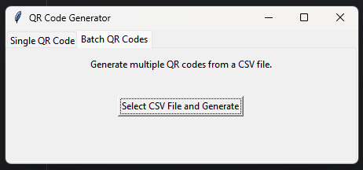

# QR Code Generator with Icons and GUI

This Python project allows users to generate QR codes with an optional feature to embed custom icons at the center. The project supports two modes:
1. **Batch Mode**: Generate multiple QR codes by processing a CSV file.
2. **Single QR Mode**: Generate a single QR code interactively, either via console or using the graphical user interface (GUI).

The GUI provides an intuitive interface for both modes, making the tool accessible to users of all technical levels.

---

## Features

- **Batch Mode**: Generate multiple QR codes by reading data from a CSV file.
- **Single QR Mode**: Create a single QR code interactively via console inputs or the GUI.
- Graphical User Interface (GUI) for easy input and operation.
- Allows overlaying an icon image at the center of the QR code.
- Supports high-resolution QR codes (3000x3000 pixels).
- Automatically organizes QR codes in an output folder.

---

## Requirements

This project requires Python 3.7 or higher and the following Python libraries:

- **[Segno](https://pypi.org/project/segno/):** For generating QR codes.
- **[Pillow](https://pillow.readthedocs.io):** For handling image processing.
- **[Tkinter](https://docs.python.org/3/library/tkinter.html):** Built-in library for GUI development (no additional installation required).

Install the required dependencies using:

```bash
pip install segno pillow
```

---

## File Structure

```plaintext
.
├── main.py             # Core QR code generation logic
├── gui.py              # Graphical User Interface
├── input.csv           # Example CSV file containing URLs, icons, and filenames
├── qr_codes/           # Folder where the generated QR codes are saved
├── images/             # Folder where the images related to the README.md are saved
├── README.md           # Project documentation
```

---

## Usage Instructions

### Option 1: Using the GUI

1. Run the `gui.py` file:
   ```bash
   python gui.py
   ```
2. Select one of the two tabs:
   - **Single QR Code**: Enter the URL, select an icon (optional), and specify a file name to generate a single QR code.
   - **Batch QR Codes**: Select a CSV file containing multiple QR code details, and the program will generate all QR codes in bulk.
3. Generated QR codes are saved in the `qr_codes` folder.

#### Screenshots

**Single QR Mode**:


**Batch QR Mode**:



### Option 2: Using the Console

#### Run the `main.py` Script
You can also use the console to generate QR codes.

1. **Single QR Mode**:
   Modify your script or call the `generate_single_qr` function from `main.py` by passing the `url`, `icon_path`, and `file_name` arguments.

2. **Batch QR Mode**:
   Prepare a CSV file with the following structure:

   | url                  | icon          | file name      |
   |----------------------|---------------|----------------|
   | https://example.com  | icon1.png     | example_qr     |
   | https://another.com  | icon2.png     | another_qr     |

   Then call the `generate_from_csv` function with the path to your CSV file.

---

## Example Output

An example of a generated QR code with an icon:


---

## Customization

### Change the QR Code Resolution
The script generates QR codes with a resolution of 3000x3000 pixels by default. You can modify the `scale` parameter in the `main.py` file:

```python
qr.save(qr_file_path, scale=30)  # Default resolution
```

For example:
- `scale=20` generates 2000x2000 pixels.
- `scale=10` generates 1000x1000 pixels.

### Adjust Icon Size
The icon size is set to 20% of the QR code size by default. You can change this by modifying the following line in the `add_icon_to_qr` function:

```python
icon_size = int(qr_width * 0.2)  # Icon size as 20% of QR code size
```

---

## Error Handling

1. **File Not Found**: Ensure the input CSV file or icon file exists in the specified paths.
2. **Invalid Image Format**: Only standard image formats (e.g., PNG, JPEG) are supported for icons.
3. **Invalid CSV Format**: Verify that the CSV file follows the required structure.
4. **Empty Inputs in Single QR Mode**: Ensure you provide valid inputs for the URL and file name.
5. **GUI-Specific**: The program will prompt users with messages if required fields are missing or invalid.

---

## Contributing

Contributions to improve this project are welcome! Feel free to fork the repository and submit a pull request with your changes.

---

## License

This project is licensed under the MIT License. You are free to use, modify, and distribute this code as you see fit. See the `LICENSE` file for more details.

---

## Acknowledgments

This project uses:
- [Segno](https://pypi.org/project/segno/) for QR code generation.
- [Pillow](https://pillow.readthedocs.io) for image processing.

Special thanks to the contributors and the open-source community for their tools and libraries.

---
