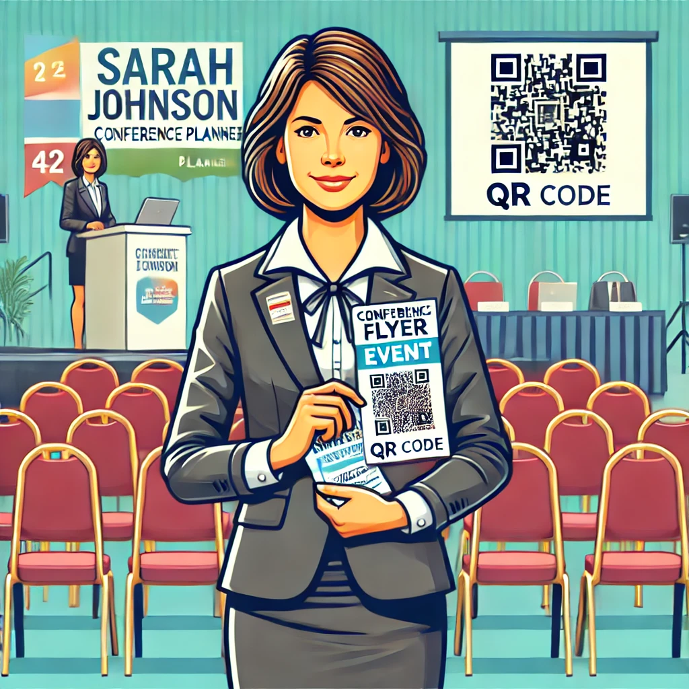

# User Personas for the QR Code Generator Project

## Emily Green - Small Business Owner

**Name:** Emily Green  
**Age:** 35  
**Occupation:** Owner of a local café  
**Tech Savviness:** Moderate  

### Goals:
- Quickly create QR codes for menu access and promotional campaigns.
- Generate branded QR codes with icons to maintain a cohesive brand identity.
- Easily manage bulk QR code needs for various locations or offers.

### Pain Points:
- Limited time to learn complex tools.
- Prefers tools with minimal setup and clear interfaces.

### Why They Use This Project:
- **Web App:** Convenient and accessible without software installation.
- **Bulk Generation:** Uploads a CSV file with menu links for multiple QR codes.
- **Icon Embedding:** Adds her café logo to each QR code for branding.

---

## Raj Mehta - Marketing Professional

**Name:** Raj Mehta  
**Age:** 28  
**Occupation:** Digital Marketer  
**Tech Savviness:** High  

### Goals:
- Automate QR code generation for marketing campaigns.
- Embed campaign-specific icons in high-resolution QR codes for print and digital materials.
- Track and manage QR code versions efficiently.

### Pain Points:
- Tools that don’t integrate well with automated workflows.
- Limited customization options for branding and analytics.

### Why They Use This Project:
- **CLI Mode:** Ideal for automated, scriptable workflows.
- **Customization Options:** Adjusts QR code resolution and icon integration for different platforms.
- **Bulk Processing:** Handles large campaigns with CSV uploads.

---

## Sarah Johnson - Event Organizer

**Name:** Sarah Johnson  
**Age:** 42  
**Occupation:** Conference Planner  
**Tech Savviness:** Basic  

### Goals:
- Generate QR codes for attendee registration, schedule access, and feedback collection.
- Provide digital resources in an eco-friendly manner.
- Ensure QR codes are professional-looking and error-free.

### Pain Points:
- Complexity in setting up tools.
- Lack of knowledge about QR code standards.

### Why They Use This Project:
- **Desktop GUI:** Simple and intuitive interface to create single or batch QR codes.
- **Icon Support:** Adds event branding to QR codes.
- **Bulk Feature:** Creates attendee-specific QR codes from CSVs.

---

## Alex Kim - Developer

**Name:** Alex Kim  
**Age:** 25  
**Occupation:** Junior Software Developer  
**Tech Savviness:** Expert  

### Goals:
- Use the project as a foundation for learning or extending functionalities.
- Add features like QR code analytics or advanced error correction levels.
- Deploy the project for client needs with minimal reconfiguration.

### Pain Points:
- Limited documentation or unclear contribution guidelines.
- Difficulty in integrating with existing APIs or tools.

### Why They Use This Project:
- **Source Code Access:** Uses the modular design as a learning and customization base.
- **Contributing.md:** Clear guidance for contributing code enhancements.
- **Dockerization and Deployment:** Deploys easily on platforms like Render or local environments.

---

## Linda Torres - Educator

**Name:** Linda Torres  
**Age:** 50  
**Occupation:** High School Teacher  
**Tech Savviness:** Moderate  

### Goals:
- Create QR codes for sharing lesson resources and assignments with students.
- Save time by automating repetitive tasks.
- Maintain simplicity for non-tech-savvy students.

### Pain Points:
- Overly technical tools that aren’t user-friendly.
- Manual processes for repetitive QR code generation.

### Why They Use This Project:
- **Web App:** Easily accessible and simple for non-technical users.
- **Desktop GUI:** Batch creation for multiple classes and assignments.
- **CSV Support:** Handles bulk creation efficiently with minimal effort.

---

**Note:** Replace "image-url-X" with the respective image file paths or URLs for each persona.
